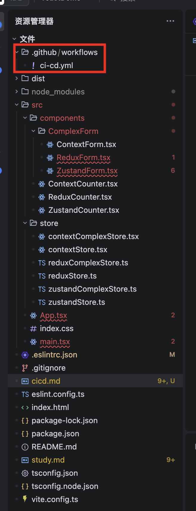
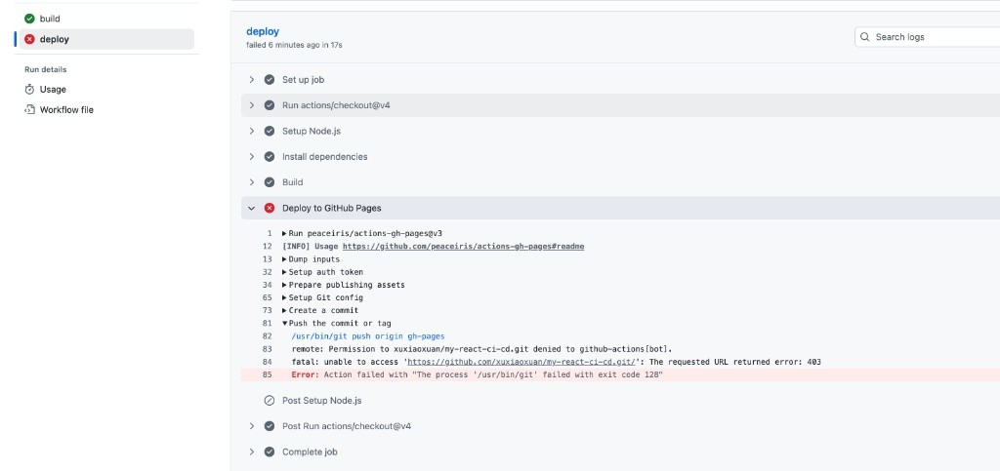

# 自动化质检与部署
CI（持续集成） 就像是自动化的“质检员”，CD（持续部署） 则是自动化的“搬运工”。

由于你用的是 Mac 且有 GitHub 账号，我们直接用最主流、最省钱、实操性最强的方案：GitHub Actions + GitHub Pages。

## 第一阶段：在 GitHub 创建“阵地”

1.  登录 [GitHub](https://github.com/)。
2.  点击右上角的 **+** 号，选择 **New repository**。
3.  **Repository name**: 输入 `my-react-ci-cd`。
4.  **Public/Private**: 选 **Public**（公开仓库可以免费使用 GitHub Actions 和 Pages）。
5.  点击底部的 **Create repository**。


---

## 第二阶段：本地初始化项目 (React + ESLint)

打开你的 Mac 终端（Terminal）：

1.  **创建项目**（使用 Vite，它自带了完善的 ESLint 配置）：
    ```bash
    pnpm create vite my-react-ci-cd --template react
    cd my-react-ci-cd
    pnpm install
    ```
2.  **测试 ESLint 是否可用**：
    执行 `pnpm lint`。你会看到它正在扫描代码。如果没有报错，说明本地配置 OK。
3.  **关联远程仓库**：
    ```bash
    git init
    git add .
    git commit -m "init project"
    git branch -M main
    # 替换成你刚才创建的仓库地址
    git remote add origin https://github.com/你的用户名/my-react-ci-cd.git
    git push -u origin main
    ```

---

## 第三阶段：编写“全自动质检与部署”脚本

在你的项目根目录下，手动创建文件夹和文件：`.github/workflows/main.yml`。


其实它就是有些工作节点，每个节点都有自己的任务，然后配置具体的执行命令即可。即name（节点名字）和run（执行命令）。
把下面这段代码贴进去，我特意加入了 **Lint 检查**：

```yaml
name: CI/CD Pipeline

on:
  push:
    branches: [ main, master ]  # 监听主分支推送
  pull_request:
    branches: [ main, master ]  # 监听 PR 到主分支

jobs:
  build:
    runs-on: ubuntu-latest

    steps:
      - uses: actions/checkout@v4

      - name: Setup Node.js
        uses: actions/setup-node@v4
        with:
          node-version: '18'
          cache: 'npm'

      - name: Install dependencies
        run: npm install --legacy-peer-deps

      - name: Lint
        # 代码风格检查，这就是一个节点名字
        # 用于检查代码是否符合 ESLint 规则
        # 例如：检查是否有未使用的的变量、是否有错误的语法等   
        run: npm run lint

      - name: 类型检查 (TypeScript)
        # 💡 这一步专门查 TS 错误，不通过就不打包
        run: npm exec tsc --noEmit

      - name: Build
        run: npm run build

  deploy:
    needs: build  # 依赖 build 任务，只有 build 成功才会执行
    runs-on: ubuntu-latest
    if: github.event_name == 'push' && (github.ref == 'refs/heads/main' || github.ref == 'refs/heads/master')  # 只在主分支推送时部署

    steps:
      - uses: actions/checkout@v4

      - name: Setup Node.js
        uses: actions/setup-node@v4
        with:
          node-version: '18'
          cache: 'npm'

      - name: Install dependencies
        run: npm install --legacy-peer-deps

      - name: Build
        run: npm run build

      # 这里添加部署步骤，例如部署到 Vercel、Netlify 等
      # 示例：部署到 GitHub Pages
      - name: Deploy to GitHub Pages
        uses: peaceiris/actions-gh-pages@v3
        with:
          github_token: ${{ secrets.GITHUB_TOKEN }}
          publish_dir: ./dist
```

---

## 第四阶段：触发并观察（模拟“翻车”现场）

这是最关键的一步，我们要看看 ESLint 是怎么拦截坏代码的。

1.  **修改代码制造错误**：
    打开 `src/App.jsx`，随便定义一个没用的变量，比如 `const a = 1;`（ESLint 默认会报 `no-unused-vars` 错误）。
2.  **推送到 GitHub**：
    ```bash
    git add .
    git commit -m "add a test error"
    git push
    ```
3.  **看 GitHub 反应**：
    * 回到 GitHub 仓库，点击 **Actions**。
    * 你会看到任务在跑，然后**变红了（失败）**！
    * 点击进去看详情，你会发现它卡在了 `代码风格检查 (ESLint)` 这一步。


---

## 🎓 面试官深问：为什么要这么配？

* **问：为什么把 Lint 放在单独的 Job 或者是 Step 的最前面？**
    * **答**：为了**“尽早失败（Fail Fast）”**。如果代码格式或者语法就有问题，完全没必要浪费服务器资源去跑后续的编译和部署。
* **问：`needs: build` 是什么意思？**
    * **答**：这定义了任务的**依赖关系**。它保证了部署（CD）必须建立在质量检查（CI）通过的基础上。

---

### 💡 下一步建议：

你现在已经成功搭建了“带质检”的自动化流程。

**你想试试在 CI 中加入“单元测试（Vitest）”吗？** 这样你的流水线就变成了：**检查语法 -> 跑测试用例 -> 编译打包 -> 自动上线**。这才是大厂标准的生产环境流程。

# deploy 分布失败怎么办

恭喜你！这其实是一个非常好的信号：**你的 Build（构建）已经成功了**（注意看左边 `build` 任务那个绿色的勾）。

现在的报错是 **403 Forbidden**，翻译成人话就是：**“你的 GitHub 机器人（Actions Bot）想把打包好的代码推送到你的仓库里，但被 GitHub 拦截了，因为它只有‘读’权限，没有‘写’权限。”**

这是 GitHub 为了安全，默认给 Actions 设定的限制。解决它非常简单，只需点三下鼠标：

---

### 🛠️ 解决步骤（保姆级）

1.  **进入仓库设置**：
    在你的 GitHub 仓库页面顶部菜单，点击最右边的 **Settings**（设置）。
2.  **找到 Actions 配置**：
    在左侧侧边栏中，找到 **Actions**，点击展开，然后选择 **General**（常规）。
3.  **修改权限**：
    向下拉，找到 **Workflow permissions**（工作流权限）这一块。
    * 你会发现它默认选的是 *“Read repository contents and packages permissions”*。
    * **将其改为：** **“Read and write permissions”**（读写权限）。
4.  **保存**：
    点击下方的 **Save** 按钮。


---

### 🚀 重新触发

设置好后，你不需要重新提交代码。

1.  回到 **Actions** 页面。
2.  点击你刚才那个失败的任务（那个红叉的任务）。
3.  点击右上角的 **Re-run jobs** -> **Re-run failed jobs**。


---

### 🎓 为什么面试官会关注这个细节？

如果在面试中提到这个坑，说明你真的动过手：

* **权限最小化原则**：你可以顺带提一句，虽然为了方便我们开了全局写权限，但在正式的生产项目中，我们更倾向于在 `.yml` 文件里通过 `permissions:` 字段，**只给特定的任务（Job）授权写权限**，而不是给整个仓库。
    > **示例代码（更高级的做法）：**
    > ```yaml
    > jobs:
    >   deploy:
    >     permissions:
    >       contents: write # 只给这个部署任务写权限
    > ```

**等这个任务跑通变成绿色后，你的网站就正式上线到 `xxx.github.io/my-react-ci-cd/` 了！

# 怎么部署到github pages
GitHub Pages 会为每个仓库提供一个免费的二级域名。

在 GitHub 仓库顶部点击 Settings。

在左侧菜单栏找到 Code and automation 分组下的 Pages。

在 Build and deployment 下方的 Source 确保选的是 Deploy from a branch。

你会看到一行字："Your site is live at ..."，后面跟着一个链接。

通常格式是：https://你的用户名.github.io/my-react-ci-cd/

## 若没网址出来，是因为分支选错了
从你这张截图来看，你已经走到了“临门一脚”的位置。但目前的配置有一个**致命的问题**：

你现在的 **Branch（分支）** 选的是 `main`。对于 React 项目来说，`main` 分支放的是源码（`.jsx`, `.tsx` 等），浏览器是读不懂源码的。浏览器需要的是你打包后的 `dist` 文件夹里的东西。

由于我们之前配置了 CI/CD，脚本会自动把打包好的文件推送到一个名为 **`gh-pages`** 的新分支。

### 🛠️ 怎么做的具体步骤：

#### 第一步：切换分支
1.  在截图中的 **Branch** 下拉菜单中，点击那个写着 `main` 的地方。
2.  在弹出的列表中选择 **`gh-pages`**。（如果没看到这个选项，说明你的 Actions 脚本还没跑通，或者还没跑完，请先去 Actions 页面确认它是绿色的）。
3.  点击旁边的 **Save** 按钮。


#### 第二步：等待部署
点击 Save 后，顶部会出现一个蓝色的进度条。大约等待 1-2 分钟，刷新这个页面，你会看到顶部出现一行字：**"Your site is live at..."**，点击那个链接就能看到你的网页了。

---

### ⚠️ 重要提醒：处理“白屏”问题

当你切换到 `gh-pages` 分支并打开网页后，如果发现是**白屏**，这是因为路径没对上。请务必检查你的 **`vite.config.js`**：

1.  打开你的代码，找到 `vite.config.js`。
2.  确保里面有这一行：
    ```javascript
    export default defineConfig({
      base: '/my-react-ci-cd/', // 这里的名字必须和你的 GitHub 仓库名一模一样
      plugins: [react()],
    })
    ```
3.  修改完后，执行 `git add .`、`git commit`、`git push`。
4.  你的 CI/CD 会**自动再次运行**，跑完后刷新网页，白屏就消失了！


---

### 🎓 为什么面试官会考你这个？

如果你在面试中能解释清楚这个逻辑，会显得你非常专业：

* **问：为什么不能直接从 `main` 分支部署 React 项目？**
    * **答**：因为 `main` 存储的是未经编译的源码。React 项目必须经过构建（Build）生成静态资源。在 CI/CD 流程中，我们利用 Actions 自动完成构建，并把结果推送到 `gh-pages` 独立分支，这样可以保持 `main` 分支的代码纯净，同时实现自动化部署。
* **问：`base` 路径的作用是什么？**
    * **答**：由于 GitHub Pages 的项目通常运行在 `username.github.io/repo-name/` 这种子路径下，如果不配置 `base`，浏览器会去根目录寻找 JS 和 CSS 文件，导致 404 错误。

**你现在去下拉菜单里能看到 `gh-pages` 这个选项吗？如果没看到，说明你的 Actions 脚本最后一步报错了，我们可以回过头去看看报错日志。**

# 提交错误不让合并分支
这是一个非常标准的**“大厂工程化工作流”**。要实现“构建失败禁止合并”，我们需要把 **GitHub Actions（自动检查）** 和 **Branch Protection（分支保护规则）** 结合起来。

以下是实现这一目标的三个关键步骤：

---

### 第一步：修改 CI 脚本，支持监听“拉取请求 (Pull Request)”

目前你的脚本可能只在代码推送到 `main` 时运行。要实现拦截，必须让它在 `dev` 向 `main` 发起合并请求时也跑起来。

修改 `.github/workflows/main.yml` 的开头部分：

```yaml
name: 自动代码检查与部署

on:
  push:
    branches: [ main ]
  # 💡 新增这一段：当有人想合并到 main 分支时触发
  pull_request:
    branches: [ main ] 

jobs:
  # ... 后面的 lint 和 build 任务保持不变
```


---

### 第二步：开启 GitHub 分支保护“门禁”

这是最关键的一步，即使 Actions 报错了，如果没有这道门禁，你依然可以手动点击合并按钮。

1.  在 GitHub 仓库页面，点击 **Settings** -> **Branches**。
2.  在 **Branch protection rules** 区域，点击 **Add branch protection rule**。
3.  **Branch name pattern**: 输入 `main`。
4.  **勾选以下核心选项：**
    * **Require a pull request before merging**: 强制必须通过 PR 合并，不能直接 push 到 main。
    * **Require status checks to pass before merging**: **（核心！）** 合并前必须通过状态检查。
5.  **搜索并添加检查任务：**
    * 在下方的搜索框里，输入你的 Job 名称（例如 `build` 或 `lint-and-test`），并勾选它。
6.  点击底部的 **Create** 或 **Save changes**。


---

### 第三步：实操验证（模拟失败场景）

现在你可以开始“破坏”代码来验证了：

1.  **在 `dev` 分支制造错误**：
    在代码里写一个明显的语法错误，或者删掉一个必要的类型，确保 `pnpm build` 会失败。
2.  **提交并推送 `dev`**：
    ```bash
    git add .
    git commit -m "fix: 故意制造一个构建错误"
    git push origin dev
    ```
3.  **发起 PR (Pull Request)**：
    在 GitHub 页面点击 **Compare & pull request**，创建一个从 `dev` 合并到 `main` 的请求。
    ```
    - 登录 GitHub，进入你的仓库
    - 点击 Pull requests 标签页
    - 点击 New pull request 按钮
    - 选择 base: main 和 compare: dev
    - 点击 Create pull request 按钮
    ```
4.  **观察拦截效果**：
    * 你会看到 PR 页面下方显示 **"Some checks were not successful"**（部分检查未通过）。
    * 原本绿色的 **Merge pull request** 按钮会变灰，并提示：**"Required statuses must pass before merging"**（必须通过必要的检查才能合并）。

###  Merge pull request按钮没置灰的原因
如果你在配置页面找不到那个选项，最有可能的原因是：**你的仓库目前是“私有（Private）”状态，且你使用的是 GitHub 免费版。**

GitHub 有一个比较“坑”的限制：对于**私有仓库**，只有付费版（Pro/Team/Enterprise）才允许强制限制管理员；如果你是**公开仓库（Public）**，这个功能对所有人都是免费开放的。

我们可以通过以下两个方案来解决这个问题：

#### 方案一：检查仓库可见性（最直接的解决办法）

如果你不介意代码公开，把仓库改为 **Public**，那个选项就会立刻跳出来：

1.  进入仓库的 **Settings** -> **General**。
2.  拉到最底部的 **Danger Zone**。
3.  点击 **Change visibility**，将其改为 **Public**。
4.  回到分支保护设置页面，你会发现 **"Do not allow bypassing the above settings"** 出现了。

---

#### 方案二：使用 GitHub 的新功能——“规则集 (Rulesets)”（我用了这个方法，成功了）

GitHub 正在用 **Rulesets** 取代旧版的分支保护。即便在某些限制下，Rulesets 的逻辑也更清晰。

1.  进入仓库的 **Settings** -> 左侧菜单点击 **Rules** -> **Rulesets**。
2.  点击 **New ruleset** -> **New branch ruleset**。
3.  **Ruleset Name**: 输入 `Admin-Lock`。
4.  **Enforcement status**: 选为 **Active**。
5.  **Target branches**: 点击 **Add target** -> **Include default branch**（即 `main`）。
6.  **Bypass list（关键！）**：
    * **默认情况下，这里是空的。**
    * 在 Rulesets 逻辑中，**只要你不把自己（或 Admin 角色）加进这个“绕过名单（Bypass list）”，那么你也必须遵守规则。**
7.  **Select rules**: 勾选 **Require status checks to pass** 并添加你的 `build` 任务。
8.  点击 **Create**。


---

#### 🎓 为什么会有这个区别？

* **旧版分支保护 (Branch Protection)**：它是“白名单”逻辑。默认管理员可以绕过，你必须手动勾选“包含管理员”来关掉特权。
* **新版规则集 (Rulesets)**：它是“黑名单”逻辑。默认所有人都被锁死，除非你显式地把某人加进 `Bypass list`。

---

### 🎓 面试官深问：为什么这样做才算专业？

作为有经验的开发者，你可以从以下几个维度升华这个话题：

* **问：为什么不在 `dev` 分支推代码时就拦截，而是要在 PR 合并时拦截？**
    * **答**：`dev` 是开发分支，允许频繁提交和暂存错误代码。但 `main` 是生产环境的基石。在 PR 环节拦截，是**“分层防御”**的思想——本地用 Husky 拦截（第一道），CI 自动检查（第二道），PR 门禁强制锁定（最后一道），确保进入主分支的代码永远是 100% 可用的。
* **问：如果紧急线上 Bug 需要绕过这个检查怎么办？**
    * **答**：在保护规则里，管理员可以勾选 **"Allow force pushes"** 或 **"Bypass branch protection"**。但除非万不得已，否则不建议使用，因为绕过检查意味着风险不可控。

**你现在的 PR 页面显示那个红色的叉了吗？如果合并按钮成功变灰了，那就说明你的“代码防火墙”已经搭建完毕了！**

